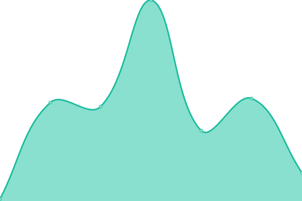

# [📈 Live Status](https://icetrust_uptime.nightwatchcybersecurity.com): <!--live status--> **🟩 All systems operational**

This repository contains the open-source uptime monitor and status page for [Upptime](https://upptime.js.org), powered by [Upptime](https://github.com/upptime/upptime).

With [Upptime](https://upptime.js.org), you can get your own unlimited and free uptime monitor and status page, powered entirely by a GitHub repository. We use [Issues](https://github.com/upptime/upptime/issues) as incident reports, [Actions](https://github.com/nightwatchcybersecurity/icetrust_uptime_example/actions) as uptime monitors, and [Pages](https://icetrust_uptime.nightwatchcybersecurity.com) for the status page.

<!--start: status pages-->
<!-- This summary is generated by Upptime (https://github.com/upptime/upptime) -->
<!-- Do not edit this manually, your changes will be overwritten -->
<!-- prettier-ignore -->
| URL | Status | History | Response Time | Uptime |
| --- | ------ | ------- | ------------- | ------ |
|  [codecov](https://icetrust_dashboard.nightwatchcybersecurity.com/data/output/codecov.json) | 🟩 Up | [codecov.yml](https://github.com/nightwatchcybersecurity/icetrust_uptime_example/commits/HEAD/history/codecov.yml) | 

 153ms
     
 | 

<a href="https://icetrust_uptime.nightwatchcybersecurity.com/history/codecov">95.37%</a>
    

|  [nixos](https://icetrust_dashboard.nightwatchcybersecurity.com/data/output/nixos.json) | 🟩 Up | [nixos.yml](https://github.com/nightwatchcybersecurity/icetrust_uptime_example/commits/HEAD/history/nixos.yml) | 

 36ms
     
 | 

<a href="https://icetrust_uptime.nightwatchcybersecurity.com/history/nixos">95.37%</a>
    

|  [rvm](https://icetrust_dashboard.nightwatchcybersecurity.com/data/output/rvm.json) | 🟩 Up | [rvm.yml](https://github.com/nightwatchcybersecurity/icetrust_uptime_example/commits/HEAD/history/rvm.yml) | 

 44ms
     
 | 

<a href="https://icetrust_uptime.nightwatchcybersecurity.com/history/rvm">95.38%</a>
    

<!--end: status pages-->

[**Visit our status website →**](https://icetrust_uptime.nightwatchcybersecurity.com)

## 📄 License

- Powered by: [Upptime](https://github.com/upptime/upptime)
- Code: [MIT](./LICENSE) © [Upptime](https://upptime.js.org)
- Data in the `./history` directory: [Open Database License](https://opendatacommons.org/licenses/odbl/1-0/)
