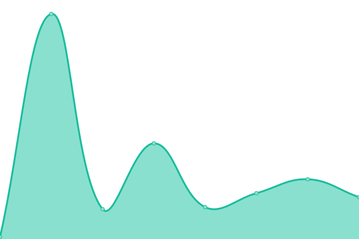

# [📈 Live Status](https://icetrust_uptime.nightwatchcybersecurity.com): <!--live status--> **🟩 All systems operational**

This repository contains the open-source uptime monitor and status page for [Upptime](https://upptime.js.org), powered by [Upptime](https://github.com/upptime/upptime).

With [Upptime](https://upptime.js.org), you can get your own unlimited and free uptime monitor and status page, powered entirely by a GitHub repository. We use [Issues](https://github.com/upptime/upptime/issues) as incident reports, [Actions](https://github.com/nightwatchcybersecurity/icetrust_uptime_example/actions) as uptime monitors, and [Pages](https://icetrust_uptime.nightwatchcybersecurity.com) for the status page.

<!--start: status pages-->
<!-- This summary is generated by Upptime (https://github.com/upptime/upptime) -->
<!-- Do not edit this manually, your changes will be overwritten -->
<!-- prettier-ignore -->
| URL | Status | History | Response Time | Uptime |
| --- | ------ | ------- | ------------- | ------ |
|  [azure cli](https://icetrust_dashboard.nightwatchcybersecurity.com/data/output/azurecli.json) | 🟩 Up | [azure-cli.yml](https://github.com/nightwatchcybersecurity/icetrust_uptime_example/commits/HEAD/history/azure-cli.yml) | 

 166ms
     
 | 

<a href="https://icetrust_uptime.nightwatchcybersecurity.com/history/azure-cli">100.00%</a>
    

|  [codecov uploader](https://icetrust_dashboard.nightwatchcybersecurity.com/data/output/codecov.json) | 🟩 Up | [codecov-uploader.yml](https://github.com/nightwatchcybersecurity/icetrust_uptime_example/commits/HEAD/history/codecov-uploader.yml) | 

 68ms
     
 | 

<a href="https://icetrust_uptime.nightwatchcybersecurity.com/history/codecov-uploader">100.00%</a>
    

|  [heroku cli](https://icetrust_dashboard.nightwatchcybersecurity.com/data/output/herokucli.json) | 🟩 Up | [heroku-cli.yml](https://github.com/nightwatchcybersecurity/icetrust_uptime_example/commits/HEAD/history/heroku-cli.yml) | 

 53ms
     
 | 

<a href="https://icetrust_uptime.nightwatchcybersecurity.com/history/heroku-cli">100.00%</a>
    

|  [ibm cloud cli](https://icetrust_dashboard.nightwatchcybersecurity.com/data/output/ibmcloudcli.json) | 🟩 Up | [ibm-cloud-cli.yml](https://github.com/nightwatchcybersecurity/icetrust_uptime_example/commits/HEAD/history/ibm-cloud-cli.yml) | 

 54ms
     
 | 

<a href="https://icetrust_uptime.nightwatchcybersecurity.com/history/ibm-cloud-cli">100.00%</a>
    

|  [nixos install script](https://icetrust_dashboard.nightwatchcybersecurity.com/data/output/nixos.json) | 🟩 Up | [nixos-install-script.yml](https://github.com/nightwatchcybersecurity/icetrust_uptime_example/commits/HEAD/history/nixos-install-script.yml) | 

 57ms
     
 | 

<a href="https://icetrust_uptime.nightwatchcybersecurity.com/history/nixos-install-script">37.29%</a>
    

|  [platform sh installer](https://icetrust_dashboard.nightwatchcybersecurity.com/data/output/platformsh.json) | 🟩 Up | [platform-sh-installer.yml](https://github.com/nightwatchcybersecurity/icetrust_uptime_example/commits/HEAD/history/platform-sh-installer.yml) | 

 56ms
     
 | 

<a href="https://icetrust_uptime.nightwatchcybersecurity.com/history/platform-sh-installer">100.00%</a>
    

|  [rustup bootstrap](https://icetrust_dashboard.nightwatchcybersecurity.com/data/output/rustup.json) | 🟩 Up | [rustup-bootstrap.yml](https://github.com/nightwatchcybersecurity/icetrust_uptime_example/commits/HEAD/history/rustup-bootstrap.yml) | 

 54ms
     
 | 

<a href="https://icetrust_uptime.nightwatchcybersecurity.com/history/rustup-bootstrap">100.00%</a>
    

|  [rvm install script](https://icetrust_dashboard.nightwatchcybersecurity.com/data/output/rvm.json) | 🟩 Up | [rvm-install-script.yml](https://github.com/nightwatchcybersecurity/icetrust_uptime_example/commits/HEAD/history/rvm-install-script.yml) | 

 62ms
     
 | 

<a href="https://icetrust_uptime.nightwatchcybersecurity.com/history/rvm-install-script">100.00%</a>
    

|  [salt bootstrap](https://icetrust_dashboard.nightwatchcybersecurity.com/data/output/saltbootstrap.json) | 🟩 Up | [salt-bootstrap.yml](https://github.com/nightwatchcybersecurity/icetrust_uptime_example/commits/HEAD/history/salt-bootstrap.yml) | 

 64ms
     
 | 

<a href="https://icetrust_uptime.nightwatchcybersecurity.com/history/salt-bootstrap">100.00%</a>
    

|  [scoop](https://icetrust_dashboard.nightwatchcybersecurity.com/data/output/scoop.json) | 🟩 Up | [scoop.yml](https://github.com/nightwatchcybersecurity/icetrust_uptime_example/commits/HEAD/history/scoop.yml) | 

 58ms
     
 | 

<a href="https://icetrust_uptime.nightwatchcybersecurity.com/history/scoop">100.00%</a>
    

|  [volta](https://icetrust_dashboard.nightwatchcybersecurity.com/data/output/volta.json) | 🟩 Up | [volta.yml](https://github.com/nightwatchcybersecurity/icetrust_uptime_example/commits/HEAD/history/volta.yml) | 

 61ms
     
 | 

<a href="https://icetrust_uptime.nightwatchcybersecurity.com/history/volta">100.00%</a>
    

<!--end: status pages-->

[**Visit our status website →**](https://icetrust_uptime.nightwatchcybersecurity.com)

## 📄 License

- Powered by: [Upptime](https://github.com/upptime/upptime)
- Code: [MIT](./LICENSE) © [Upptime](https://upptime.js.org)
- Data in the `./history` directory: [Open Database License](https://opendatacommons.org/licenses/odbl/1-0/)
