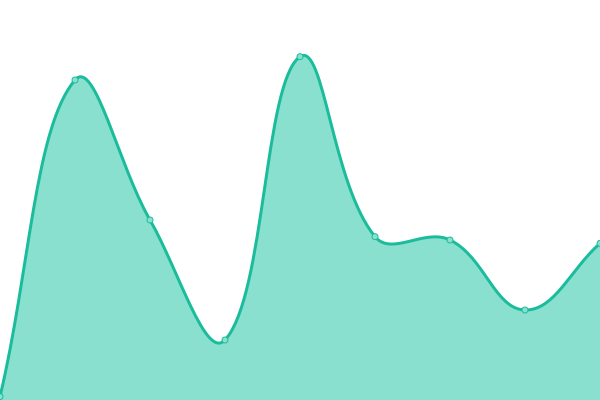
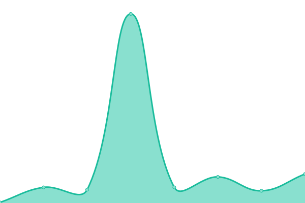
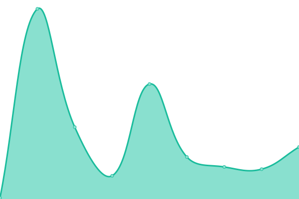
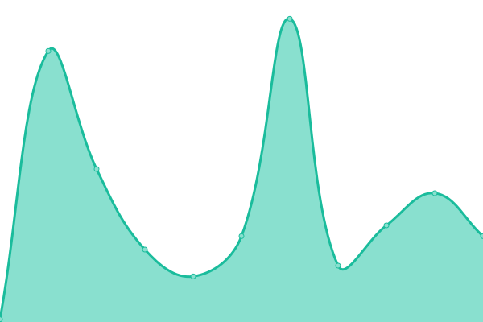
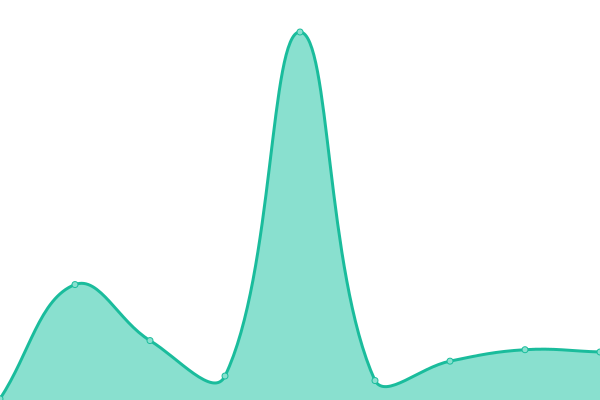
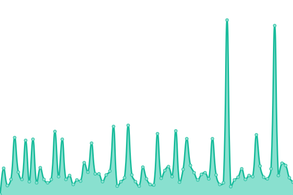
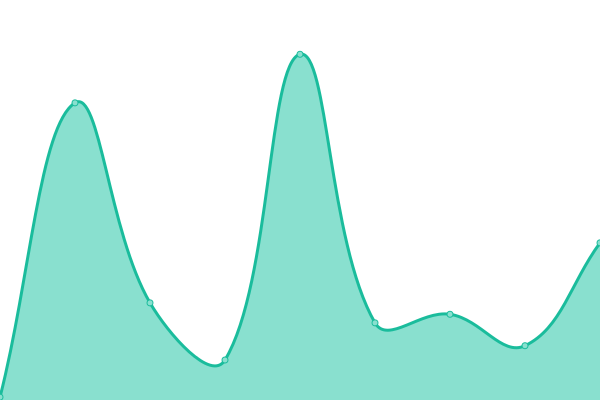
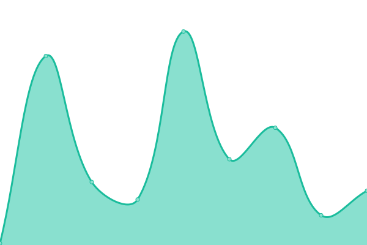

# [📈 Live Status](https://icetrust_uptime.nightwatchcybersecurity.com): <!--live status--> **🟧 Partial outage**

This repository contains the open-source uptime monitor and status page for [Upptime](https://upptime.js.org), powered by [Upptime](https://github.com/upptime/upptime).

With [Upptime](https://upptime.js.org), you can get your own unlimited and free uptime monitor and status page, powered entirely by a GitHub repository. We use [Issues](https://github.com/upptime/upptime/issues) as incident reports, [Actions](https://github.com/nightwatchcybersecurity/icetrust_uptime_example/actions) as uptime monitors, and [Pages](https://icetrust_uptime.nightwatchcybersecurity.com) for the status page.

<!--start: status pages-->
<!-- This summary is generated by Upptime (https://github.com/upptime/upptime) -->
<!-- Do not edit this manually, your changes will be overwritten -->
<!-- prettier-ignore -->
| URL | Status | History | Response Time | Uptime |
| --- | ------ | ------- | ------------- | ------ |
|  [azure cli](https://icetrust_dashboard.nightwatchcybersecurity.com/data/output/azurecli.json) | 🟩 Up | [azure-cli.yml](https://github.com/nightwatchcybersecurity/icetrust_uptime_example/commits/HEAD/history/azure-cli.yml) | 

 275ms
     
 | 

<a href="https://icetrust_uptime.nightwatchcybersecurity.com/history/azure-cli">100.00%</a>
    

|  [codecov uploader](https://icetrust_dashboard.nightwatchcybersecurity.com/data/output/codecov.json) | 🟩 Up | [codecov-uploader.yml](https://github.com/nightwatchcybersecurity/icetrust_uptime_example/commits/HEAD/history/codecov-uploader.yml) | 

 69ms
     
 | 

<a href="https://icetrust_uptime.nightwatchcybersecurity.com/history/codecov-uploader">100.00%</a>
    

|  [dotnet installer](https://icetrust_dashboard.nightwatchcybersecurity.com/data/output/dotnetcli.json) | 🟩 Up | [dotnet-installer.yml](https://github.com/nightwatchcybersecurity/icetrust_uptime_example/commits/HEAD/history/dotnet-installer.yml) | 

 61ms
     
 | 

<a href="https://icetrust_uptime.nightwatchcybersecurity.com/history/dotnet-installer">100.00%</a>
    

|  [fusionauth installer](https://icetrust_dashboard.nightwatchcybersecurity.com/data/output/fusionauth.json) | 🟩 Up | [fusionauth-installer.yml](https://github.com/nightwatchcybersecurity/icetrust_uptime_example/commits/HEAD/history/fusionauth-installer.yml) | 

 90ms
     
 | 

<a href="https://icetrust_uptime.nightwatchcybersecurity.com/history/fusionauth-installer">100.00%</a>
    

|  [gcloud cli](https://icetrust_dashboard.nightwatchcybersecurity.com/data/output/gcloudcli.json) | 🟩 Up | [gcloud-cli.yml](https://github.com/nightwatchcybersecurity/icetrust_uptime_example/commits/HEAD/history/gcloud-cli.yml) | 

 72ms
     
 | 

<a href="https://icetrust_uptime.nightwatchcybersecurity.com/history/gcloud-cli">100.00%</a>
    

|  [heroku cli](https://icetrust_dashboard.nightwatchcybersecurity.com/data/output/herokucli.json) | 🟥 Down | [heroku-cli.yml](https://github.com/nightwatchcybersecurity/icetrust_uptime_example/commits/HEAD/history/heroku-cli.yml) | 

 38ms
     
 | 

<a href="https://icetrust_uptime.nightwatchcybersecurity.com/history/heroku-cli">0.00%</a>
    

|  [homebrew](https://icetrust_dashboard.nightwatchcybersecurity.com/data/output/homebrew.json) | 🟩 Up | [homebrew.yml](https://github.com/nightwatchcybersecurity/icetrust_uptime_example/commits/HEAD/history/homebrew.yml) | 

 51ms
     
 | 

<a href="https://icetrust_uptime.nightwatchcybersecurity.com/history/homebrew">99.03%</a>
    

|  [magento cloud cli](https://icetrust_dashboard.nightwatchcybersecurity.com/data/output/magentocloudcli.json) | 🟩 Up | [magento-cloud-cli.yml](https://github.com/nightwatchcybersecurity/icetrust_uptime_example/commits/HEAD/history/magento-cloud-cli.yml) | 

 98ms
     
 | 

<a href="https://icetrust_uptime.nightwatchcybersecurity.com/history/magento-cloud-cli">100.00%</a>
    

|  [nixos install script](https://icetrust_dashboard.nightwatchcybersecurity.com/data/output/nixos.json) | 🟩 Up | [nixos-install-script.yml](https://github.com/nightwatchcybersecurity/icetrust_uptime_example/commits/HEAD/history/nixos-install-script.yml) | 

 1522ms
     
 | 

<a href="https://icetrust_uptime.nightwatchcybersecurity.com/history/nixos-install-script">98.99%</a>
    

|  [pip bootstrap](https://icetrust_dashboard.nightwatchcybersecurity.com/data/output/pip.json) | 🟩 Up | [pip-bootstrap.yml](https://github.com/nightwatchcybersecurity/icetrust_uptime_example/commits/HEAD/history/pip-bootstrap.yml) | 

 91ms
     
 | 

<a href="https://icetrust_uptime.nightwatchcybersecurity.com/history/pip-bootstrap">100.00%</a>
    

|  [platform sh installer](https://icetrust_dashboard.nightwatchcybersecurity.com/data/output/platformsh.json) | 🟩 Up | [platform-sh-installer.yml](https://github.com/nightwatchcybersecurity/icetrust_uptime_example/commits/HEAD/history/platform-sh-installer.yml) | 

 48ms
     
 | 

<a href="https://icetrust_uptime.nightwatchcybersecurity.com/history/platform-sh-installer">100.00%</a>
    

|  [pnpm](https://icetrust_dashboard.nightwatchcybersecurity.com/data/output/pnpm.json) | 🟩 Up | [pnpm.yml](https://github.com/nightwatchcybersecurity/icetrust_uptime_example/commits/HEAD/history/pnpm.yml) | 

 41ms
     
 | 

<a href="https://icetrust_uptime.nightwatchcybersecurity.com/history/pnpm">61.96%</a>
    

|  [poetry](https://icetrust_dashboard.nightwatchcybersecurity.com/data/output/poetry.json) | 🟩 Up | [poetry.yml](https://github.com/nightwatchcybersecurity/icetrust_uptime_example/commits/HEAD/history/poetry.yml) | 

 55ms
     
 | 

<a href="https://icetrust_uptime.nightwatchcybersecurity.com/history/poetry">100.00%</a>
    

|  [rustup bootstrap](https://icetrust_dashboard.nightwatchcybersecurity.com/data/output/rustup.json) | 🟩 Up | [rustup-bootstrap.yml](https://github.com/nightwatchcybersecurity/icetrust_uptime_example/commits/HEAD/history/rustup-bootstrap.yml) | 

 57ms
     
 | 

<a href="https://icetrust_uptime.nightwatchcybersecurity.com/history/rustup-bootstrap">100.00%</a>
    

|  [rvm install script](https://icetrust_dashboard.nightwatchcybersecurity.com/data/output/rvm.json) | 🟩 Up | [rvm-install-script.yml](https://github.com/nightwatchcybersecurity/icetrust_uptime_example/commits/HEAD/history/rvm-install-script.yml) | 

 51ms
     
 | 

<a href="https://icetrust_uptime.nightwatchcybersecurity.com/history/rvm-install-script">100.00%</a>
    

|  [scoop](https://icetrust_dashboard.nightwatchcybersecurity.com/data/output/scoop.json) | 🟩 Up | [scoop.yml](https://github.com/nightwatchcybersecurity/icetrust_uptime_example/commits/HEAD/history/scoop.yml) | 

 64ms
     
 | 

<a href="https://icetrust_uptime.nightwatchcybersecurity.com/history/scoop">100.00%</a>
    

|  [sdkman](https://icetrust_dashboard.nightwatchcybersecurity.com/data/output/sdkman.json) | 🟩 Up | [sdkman.yml](https://github.com/nightwatchcybersecurity/icetrust_uptime_example/commits/HEAD/history/sdkman.yml) | 

 68ms
     
 | 

<a href="https://icetrust_uptime.nightwatchcybersecurity.com/history/sdkman">100.00%</a>
    

<!--end: status pages-->

[**Visit our status website →**](https://icetrust_uptime.nightwatchcybersecurity.com)

## 📄 License

- Powered by: [Upptime](https://github.com/upptime/upptime)
- Code: [MIT](./LICENSE) © [Upptime](https://upptime.js.org)
- Data in the `./history` directory: [Open Database License](https://opendatacommons.org/licenses/odbl/1-0/)
